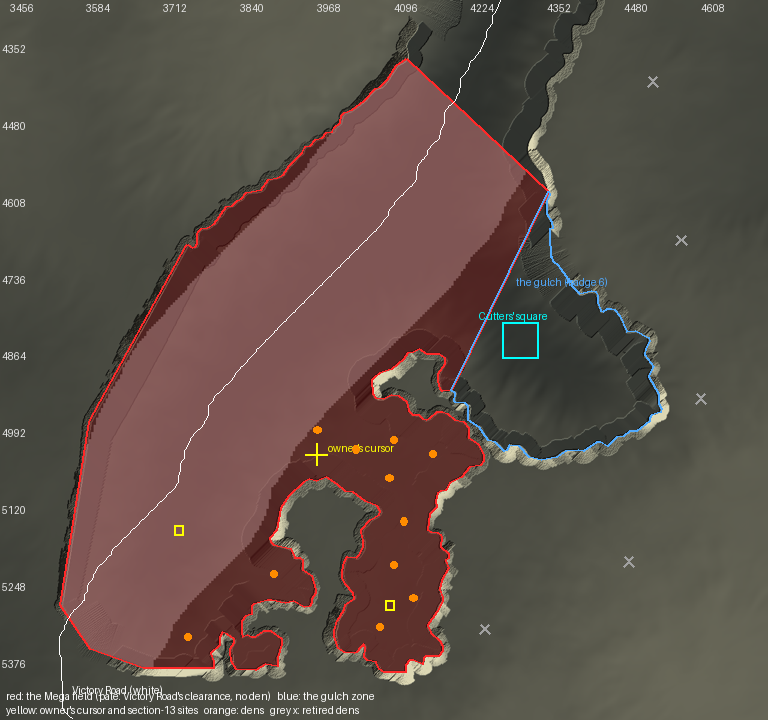

# The Mega field: the south-west Rift basin as one hostile Mega farm

**Status: designed and built offline 2026-10-03 (sections 1-4); the existing gulch and den audits are clean; not
installed, not in any world, not seen in game. The owner confirms the area (section 1) and four calls (section 4).**

The owner, 2026-10-03, on a minimap screenshot of the Rift: *"everywhere in the red inside the rift should be the mega
area, not just spawn one randomly in the world. the idea is an aggressive and hostile resource farm as discussed in
some chat a while ago. you would go in and fight high level megas that in theory should require more than one mon to
kill and get a reward to spend in the big town next to this area in the rift."*

The screenshot itself was not seen by the session that wrote this; it was relayed as a description (two connected
lobes of Rift floor, a large western lobe and a narrower inner arm running south between two dark ravines; the cursor
at X 3967 Z 5037; the big town to the north-east across a pale line). **Everything below is measured from data and
the canonical heightmap, and the owner confirms the area on the picture.**

## 1. The area

`MEGA_FIELD.png` (`python tools/mega_field.py map --out docs/world-building/MEGA_FIELD.png`): the heightmap, the field
in red, the gulch zone in blue, the Cutters' square in cyan, Victory Road's walked line in white, the owner's cursor and
his two section-13 coordinates in yellow, the seven 2026-10-01 dens in orange.

| What | Value | Source |
| --- | --- | --- |
| Polygon | `data/gulch_mine.json` `mega_field.polygon`, 216 vertices, **473,215 columns**, bbox x 3541-4355, z 4377-5401 | `python tools/mega_field.py trace` |
| Rule | the Rift sculpt's lip ring (`derived/rift_sculpt/plan.json` `ring`), outset 3 along the rim like the gulch zone, from the gulch zone's south-west end (ring 3430, (4195, 4929)) away from the gulch round the inner arm and the south-west basin, up the west wall to ring 6902 (4120, 4379), straight across the stem (319.7 blocks) to the gulch zone's north-east end (ring 2574, (4351, 4600)), and back along the gulch zone's own closing line | `mega_field.trace` |
| Overlap with the gulch zone | 0 columns: the two share the gulch's closing edge | measured |
| The owner's cursor (3967, 5037) | inside; ground y117 | `tools/ground.py` |
| SOUTHERN_RIFT_MEGA.md:650's two sites (4090, 116, 5289), (3738, 87, 5164) | both inside; ground y116 and y87 | `tools/ground.py` |
| The town north-east of it | the Cutters' Gulch: square (4278-4338, 4818-4878), the Cutters' workshop at (4288-4312, 4896-4911), inside the gulch zone | `gulch_mine.json` `town` |
| The owner's traced region here | `hidden_rift_cavern` (`data/rift_regions.json`, 118,802 columns, bbox 3658-4125, 4574-5079) lies inside the field's western lobe | `rift_deep.region_mask` |

**Match with the description.** The basin south-west of the gulch is exactly two connected lobes: the large western
lobe (x 3550-4000) and an inner arm (x 4030-4170, z 5050-5370) running south between two tongues of high ground. The
Cutters' Gulch lies north-east of the cursor, across the gulch's closing line. The "pale line running NW-SE" is not
identified from data (candidates: the gulch's rim, Victory Road's path); this does not change the area.

**What the owner must confirm on the picture.** (a) Where the field stops up the stem: the cut at the narrowest
crossing from the gulch line's north-east end (z about 4380-4600) is this tool's choice; the map did not show it.
(b) The field includes the Rift floor under **Victory Road's walked line** (white): see section 2's findings.

## 2. The earlier design, and what was built instead

**The design the owner refers to is `docs/world-building/SOUTHERN_RIFT_MEGA.md` section 13 (2026-09-27).** It agrees
with his message on every point it covers:

- Hostile Megas as the resource: *"a player will fight the mega mons I have roaming for resources, that they will then
  use to buy mega stones"* (`SOUTHERN_RIFT_MEGA.md:645-646`); the site has *"hostile roaming Megas"* (`:7`, section 6).
- A late-game farm, not free stones: *"I don't want mega stones being free, I want this to be a sort of late game
  farm"*; the currency is the raw `mega_showdown:mega_stone`, a finished stone is never dropped (`:647-649`).
- **Where: *"the southern Rift's two western zones, around (4090, 116, 5289) and (3738, 87, 5164) (the owner's
  coordinates). They look as if a world broke there and something powerful moved in: caves, Mega dens, broken houses
  half sunk, debris"*** (`:650-652`). Both points are inside the field of section 1: its inner arm and its western lobe.
- Levels: outer *"about 60 (the owner: 'if cap after gym 5 is 50 … lvl 60 or so, so it takes a team')"*, 15% a defeat;
  deeper 65-70, 25-35% (ASSUMED) (`:653-658`).
- Spent where: the raw stone buys a keyed stone at the Cutters in the gulch town, 2 raw stones plus a diamond
  (`:664-667`; `data/gulch_mine.json` `cutters.offer.raw_count` 2).
- Hostility: *"The owner wants Megas to attack on sight unless the player is 20 or more levels above them"*; Fight or
  Flight's `always_aggro_aspects` was set to the Mega aspects on staging; the 20-level exemption is not a config key
  (M-3b); whether an always-aggressive aspect overrides `light_dependent_unprovoked_attack` is open (M-3) (`:671-683`).
- **Held:** *"Both sites lie in the south-west arm, inside Victory Road's zone Z2, which RIFT_ZONES gates at 8 badges.
  Section 13 puts the farms after gym 6. The owner decides between carving a gym-6 zone out of Z2 and waiting for 8
  badges"* (`:706-709`; `RIFT_STATUS.md:264-268`, `:479-481`). No answer is recorded anywhere in `docs/`.

**What was built instead (2026-10-01).** Research commit `485e364` measured *"12 open-ground den sites across both
southern arms ... inside the arm polygons"*: `data/regions.json`'s `rift_south_west_arm` and `rift_south_east_arm`
subregions, 0.54 and 0.61 km2 of painted cover that take in the plateau round the basin. Seven were placed (`70dcd65`,
unparked `5198d14`; `gulch_mine.json` `farms`, `farms_why`), B4 dropped their zones (`cbcff87`;
`docs/DECISION_QUEUE.md:24`), and R9MD dressed them as lairs (`data/mega_dens.json`, `MEGA_DENS.md`). **None of the
seven is in the field, or in the basin at all** (measured against the polygon and `derived/rift_sculpt/basin.npy`): all
stand on high ground at y121-148, 163 to 1,133 blocks from the nearest owner coordinate (Garchomp, (4248, 5328), is the
163). That is the "spawn one randomly in the world" the owner objects to. The misreading was the name "south-west arm":
`RIFT_ZONES.md:21-45` uses it for the BASIN arm Victory Road runs up; the den search used the subregion of that name.

**What the new design supersedes.** The seven `farms` and their `farms_why` (`farms_grid` stays as the dens' bound),
and the seven `data/mega_dens.json` lairs that dress them. Kept unchanged: the gulch's zone and gate, the Cutters, the
drop roll, the two Cutting Floor Megas, `drops`, the keeper. B4 ("no zone on the open dens") is not contradicted: the
field declares no zone of its own (section 4).

**Two findings the owner must see.**

1. **The field is inside Z2 (8 badges) today.** `data/rift_zones.json` `zones.z2.boxes` cover 370,182 of the field's
   473,215 columns (measured); the rest is the floor south of the owner's traced `hidden_rift_cavern`. Unless Z2 is
   cut, the field is an 8-badge farm (level cap 60, `docs/mechanics/LEAGUE_LEVEL_CAP.md` section 2), not the gym-6
   one section 13 wrote. This is the 2026-09-27 held question, unchanged.
2. **Victory Road walks through the field.** `data/route_paths.json` `victory_road` crosses the lip at the south-west
   tip and runs north-east across the western lobe and up the stem (white line). Aggressive Megas beside the critical
   path change Victory Road. Section 4 keeps every den off the walked line; whether the owner wants that is his call.

## 3. What is known, with sources

**Can a wild Pokemon here be aggressive toward players? Yes, by configuration, with one open gate.**

| Question | Answer | Source |
| --- | --- | --- |
| What makes a wild Mega aggressive | Fight or Flight 0.11.0 (the jar `modpack/manifest/overlay.json` pins, SHA-1 `d3031a63`, read 2026-10-03): any aspect in `always_aggro_aspects` makes a wild Pokemon aggressive; a player's own is excluded (`!isPlayerOwned()`) | `docs/research/notes/wild-mega-pokemon.md:118-138` (FoF source); `fightorflight.json5:97-104` |
| Is it configured | Yes: `always_aggro_aspects` = `alpha, mega, mega_x, mega_y, mega_z` on the server since 2026-09-27 | `server/config/mods/fightorflight.json5:98-104`; `SOUTHERN_RIFT_MEGA.md:672-674` |
| Does it pursue and hit the player | FoF's unprovoked attack: `do_pokemon_attack_unprovoked: true`, level >= `minimum_attack_unprovoked_level` 25 | `fightorflight.json5:5`, `:17` |
| **In daylight, outdoors** | **Probably not.** `light_dependent_unprovoked_attack: true`: FoF's comment says aggressive Pokemon "will only attack unprovoked in the dark area"; the note reads the gate as applying to `always_aggro` too. In the installed jar both FoF classes that read the key call intermediary `method_5718` (a brightness read). The Rift's thunder is sounds and bolts, not weather (`data/rift_storm.json` `note`), so the sky is not darkened | `fightorflight.json5:6-7`; `wild-mega-pokemon.md:133-136` (cut-off ASSUMED ~light 12); jar read |
| Forced battle | When a Mega and a player's sent-out Pokemon trade a hit a battle starts (`force_wild_battle_on_pokemon_hurt: true`); a Mega hitting the player only hurts (`force_wild_battle_on_player_hurt: false`) | `fightorflight.json5:231`, `:235` |
| A command that starts a wild battle | **None in Cobblemon 1.8.0.** Its command classes (jar `ed0bbc67`, read 2026-10-03) include `StopBattleCommand` and `SpectateBattleCommand`, nothing that starts one. `RunMolangCommand` exists; whether MoLang can start a battle is unknown and is not used | jar read |
| The 20-levels-above exemption | Not a FoF key | `SOUTHERN_RIFT_MEGA.md:677-680` (M-3b) |

So the field is aggressive **at night** by today's config, and **by day only if** either the light gate does not apply
to `always_aggro` aspects (unknown) or the owner turns `light_dependent_unprovoked_attack` off, a documented key whose
effect is GLOBAL (every aggressive wild Pokemon on the map attacks by day). Neither is assumed:
**`experiments/EXP-054-mega-field-hostility/README.md`** settles it in one staging session (noon, midnight, the aspect
string, the forced battle, one timed win).

**What the keeper already does (read in `tools/gulch_mine.py`, `keeper_files`, lines 1329-1531).**

- Holds one Mega per den: spawned at the den's anchor through the macro `megas/spawn_at` (`spawnpokemonat ... <aspect>
  uncatchable level=<L>`, EXP-046), tagged `cobblers.gm`, `cobblers.gm.<den>`, `cobblers.gm.farm`,
  `PersistenceRequired`; a duplicate is killed.
- Respawns: a per-den clock (`gm.gone`) starts the first time the Mega is seen gone on two passes in a row; it returns
  `respawn_ticks` later and only with nobody within `spawn_clear` (24) of the anchor. Nothing a player repeats moves it.
- Levels: a den's own `level`, else its farm tier's (`farm_tiers`), so a whole field can be re-levelled in one line.
- Leash: every 40 ticks a Mega further than `leash` from its anchor is `tp`'d back (while a player is in the farm's
  approach box). Driver: a farm's keeper runs every 100 ticks only while a player is inside its `approach` box.
- Drop: a battle win (the `battle_fainted` callback, matched by the Pokemon UUID stored at bind) or a kill outside a
  battle (the attacker watch) rolls the den's `drop_percent` once per Mega; a win drops one raw
  `mega_showdown:mega_stone` at the victor's feet, owner-only. The callback rolls for the FIRST player in the battle.
- Cost: `megas/watch` runs every tick as each loaded farm Mega; the keeper and the leash are one selector per farm per
  pass. More dens means more `watch` runs only where Megas are loaded.

**The reward and where it is spent: already designed, nothing new needed.** The raw `mega_showdown:mega_stone`
(`gulch_mine.json` `drops`) is spent at the **Cutters' workshop in the Cutters' Gulch**, the town north-east of the
field: three bench masters turn 2 raw stones and a diamond into a keyed Mega stone, unlimited, 60 stones offered
(`cutters.offer`, `cutters.benches`; `SOUTHERN_RIFT_MEGA.md:664-667`). No CobbleDollars, token or trader is added: the
section-13 design is a material chain, and `docs/vision/GAME_VISION.md` "Team building as the central skill" wants
rewards placed, not a shop dump. The Mining Town's Exchange (`data/traders.json`) sells evolution stones and is not
part of this.

## 4. What is built (offline; not installed, not in any world)

Rung: **datapack + functions** through the existing keeper (Cobblemon's `spawnpokemonat`, the gulch pack's tick) and
**configuration** for aggression (FoF, already set). No new mechanism, mod or dependency.

**11 dens in 6 farms**, all in the field, laid out by `python tools/mega_field.py sites` from
`data/gulch_mine.json` `mega_field.layout` (every threshold has its derivation in `layout.why`):

| Farm | Den | Mega | Anchor | Tier, level | From Victory Road |
| --- | --- | --- | --- | --- | --- |
| field_2_3 | gm_field_2_3_1 | Houndoom | (3969, 113, 4997) | outer 70 | 165 |
| field_2_3 | gm_field_2_3_2 | Garchomp | (4097, 117, 5013) | deeper 77 | 269 |
| field_2_3 | gm_field_2_3_3 | Absol | (4033, 116, 5029) | outer 70 | 233 |
| field_2_3 | gm_field_2_3_4 | Charizard (Mega X) | (4089, 117, 5077) | deeper 77 | 307 |
| field_3_3 | gm_field_3_3_1 | Metagross | (4161, 118, 5037) | deeper 77 | 332 |
| field_1_4 | gm_field_1_4_1 | Banette | (3897, 120, 5237) | outer 70 | 220 |
| field_2_4 | gm_field_2_4_1 | Steelix | (4113, 119, 5149) | deeper 77 | 371 |
| field_2_4 | gm_field_2_4_2 | Gallade | (4097, 118, 5221) | deeper 77 | 386 |
| field_2_4 | gm_field_2_4_3 | Venusaur | (4073, 118, 5325) | deeper 77 | 413 |
| field_3_4 | gm_field_3_4_1 | Blaziken | (4129, 119, 5277) | deeper 77 | 438 |
| field_1_5 | gm_field_1_5_1 | Camerupt | (3753, 115, 5341) | outer 70 | 184 |

- **Levels** (`farm_tiers.field_outer` 70, `field_deeper` 77): the owner's own rule, "cap 50 ... lvl 60 or so, so it
  takes a team" (`SOUTHERN_RIFT_MEGA.md:657`), is the cap plus about 10 (plus 17 deeper). The field is inside Z2, where
  the cap is 60 (`LEAGUE_LEVEL_CAP.md` section 2), so 70 and 77. If the owner carves a gym-6 zone instead, the same
  rule gives 60 and 67: one number each. A Mega form 10-17 levels over the party's cap is meant to need several
  partners; that is ASSUMED until EXP-054 A6 times a win.
- **Drops and respawn**: section 13's, unchanged: 15% / 30% one raw `mega_showdown:mega_stone`, owner-only, at the
  victor's feet; respawn 10 / 15 minutes per den, only with nobody within 24.
- **Where it is spent**: the Cutters' workshop in the Cutters' Gulch (2 raw stones and a diamond a keyed stone).
- **Seen from the air**: every den is dressed as a lair (`data/mega_dens.json` `dens`, step R9MD) with the kit of one of
  the seven 2026-10-02 lairs (`mega_field.dressing.kit_of`; `python tools/mega_field.py dress`).
- **Retired**: the seven 2026-10-01 dens are `superseded_farms` (with `superseded_farms_why`, `superseded_farms_grid`
  and the reason) and their lairs `data/mega_dens.json` `superseded_dens`. `farms_grid` is re-derived from the field.
  The gulch pack gains `megas/retire`, which kills any Mega still tagged with a retired den and clears its drop-roll
  storage.

**Re-application (`tools/reapply.py`).** prepare: a new job `mega_field:check` (before `gulch_mine:build`) fails if the
committed polygon, farms, `farms_grid` or lair records differ from what `trace`, `sites` and `dress` derive. run: the
field's dens are in the gulch pack, so **R9S** carries them and the keeper spawns them itself; new step **R9SX** (after
R9S) holds the ground round each retired den, waits 5 s, runs `cobblers:gulch_mine/megas/retire` and releases it; **R9MD**
now dresses the 11 field lairs (44 actions) instead of the seven.

**Ran offline in this worktree (2026-10-03):** `mega_field.py check` clean; `gulch_mine.py build`, then the existing
`gulch_mine_audit.py` CLEAN 0; `mega_dens.py build` (6,304 commands), then the existing `mega_dens_audit.py` clean 0;
`validate_data.py` 0 errors. Pytest on the gulch, Mega den, id-authorship and reapply suites: 200 passed, 5 failed: four
in `tests/test_mega_dens.py` pin the seven dens (`len(mine) == 7`, mutations aimed at Pinsir and Abomasnow), and
`test_reapply_runs_r9s_after_r9m...` stops in `rift_zone_steps` on its own monkeypatched index ("x"), not on anything
here (read, not run against the base). **Not run:** prepare, the full suite, any server, any world.

**The owner's calls.**

1. **Victory Road's clearance empties most of the western lobe (the pale band on the map).** Every lair keeps 128 off
   the critical path (`mega_dens_audit.py`'s footprint rule) and 27 more for its box, so no den is within 155 of the
   walked line: 9 of 11 stand in the inner arm, 2 at the western lobe's southern end. If he wants Megas along Victory
   Road, the lairs' 128 rule must change for the field (an audit change: its author's, not this one's); with
   `road_clear` at 84 the same ground gives 14 (measured). The ground is the other limit: of 680 candidate pads clear
   of the road, the edges and the gate, 412 are level enough for a pad and a lair (its 27-radius within -6..+7 of the
   anchor's ground), and 64-block spacing seats 11 of them.
2. **Z2 or a gym-6 zone** (held since 2026-09-27): decides whether the levels are 70/77 or 60/67.
3. **Day or night hostility** after EXP-054: today's config makes the field hostile at night only (probably).
4. Staging still holds the seven retired lairs' blocks (R9MD, 2026-10-02); R9SX removes their Megas, not the blocks.
   A fresh export clears them.

## 5. Checklist for the independent audit (another agent)

Not written here, by rule. Each item names its independent source; none may import `tools/mega_field.py` geometry.

1. **The area.** Rebuild the basin from `derived/rift_sculpt/basin.npy` (not the ring) and check every column of
   `mega_field.polygon` that is basin is south-west of the gulch's closing line, that the polygon holds the owner's
   cursor (3967, 5037) and both `SOUTHERN_RIFT_MEGA.md:650` points, and overlaps the gulch zone polygon by 0 columns.
   Mutate the GENERATOR (`rim_outset` read as 0 inside `trace`, data untouched) and see `mega_field.py check` fail.
2. **Every den in the field and in the basin**: anchor inside `mega_field.polygon` and `basin.npy`; anchor y =
   `round(ground) + 1` from `tools/ground.py`.
3. **Clearances from their own sources**: each anchor at least `road_clear` from `data/route_paths.json` victory_road's
   points, `gulch_clear` from `zone.polygon`, 59 from `rift_zones.json` z2's post and guard points, 64 from every other
   den; no lair box inside `grid`.
4. **Levels against the real cap**: compute the cap for 8 badges from rctmod's rule and the trainer data
   (`LEAGUE_LEVEL_CAP.md` section 1), not from `farm_tiers.field_why`; every field den's level in the BUILT
   `megas/spawn_<den>.mcfunction` is cap + 10 (outer) or cap + 17 (deeper).
5. **One den per species** across the farms (the lair file names collide otherwise) and every species/aspect a real
   Mega in the pinned Mega Showdown jar (`species_feature_assignments`), none on `CLIENT_MODEL_FIXES.md`'s broken list.
6. **The drop chain end to end in the built pack**: each field den has `bind_`, `hit_`, `roll_`, `slain_`,
   `hitter_` functions, the `battle_fainted` callback names `drops/fainted`, the dropped item is
   `cutters.offer.raw`, and that item is what every Cutters bench trade buys.
7. **Retirement**: `megas/retire` kills exactly the seven `superseded_farms` den tags and no live one; R9SX's forceloads
   cover each retired anchor +- (leash + 16); no keeper, leash or `drops/fainted` line names a retired den.
8. **Re-application order**: R9S < R9SX < R9MD < R9E; R9MD runs one lair per field den; prepare runs
   `mega_field:check` before `gulch_mine:build`.
9. **Tick cost**: count the commands `megas/watch` runs per tick per loaded farm Mega, times 11, against
   `docs/mechanics/TOWN_TICK_BUDGET.md`.
10. **In game (EXP-054, staging, with the lock)**: A1-A6, plus a Mega respawning after a plain restart (the macro, M-2)
    and a raw stone refused to a second player.
